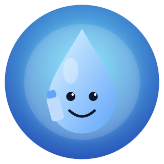

# Hydration Assistant

<p align="center">
  
</p>

**Repository:** [github.com/karnavpargi/hydration-assistant](https://github.com/karnavpargi/hydration-assistant) · **Author:** Karnav Pargi

Context-aware hydration reminders for Visual Studio Code. Reminders follow **focused coding time** (not a blind wall-clock timer): continuous activity builds toward a reminder; going idle or switching away pauses or resets the cycle.

## Features (MVP)

- **Activity-based timing**: tracks typing, saves, debug sessions, and window focus.
- **Smart mode**: adjusts the effective interval using recent edit intensity, rapid file switching, and debugging (see settings).
- **Non-intrusive UI**: status bar summary and optional short sound; reminders use the standard information message (not modal).
- **Local-only metrics**: optional counters and approximate active time stored under the extension global storage path. Nothing is sent over the network.

## Commands

| Command | Action |
|--------|--------|
| **Hydration: Snooze reminders** | Pauses reminders for `hydration.snoozeMinutes`. |
| **Hydration: Reset session timer** | Clears accumulated focused time for the current cycle. |
| **Hydration: Toggle presentation mode** | Flips `hydration.suppressInPresentation` (useful before demos). |
| **Hydration: Open settings** | Opens Settings filtered to `hydration` keys. |

## Settings

| ID | Default | Description |
|----|---------|-------------|
| `hydration.interval` | `25` | Minutes of continuous **focused, non-idle** activity before a reminder. |
| `hydration.idleResetMinutes` | `5` | Minutes without activity before the work session resets. |
| `hydration.enableSound` | `true` | Plays a short system sound when a reminder appears (best-effort per OS). |
| `hydration.mode` | `smart` | `smart`: adapt using activity signals; `fixed`: use `interval` only. |
| `hydration.sensitivity` | `medium` | How strongly rapid edits and file switching affect smart timing. |
| `hydration.snoozeMinutes` | `15` | Default snooze length from the toast or the Snooze command. |
| `hydration.suppressInPresentation` | `false` | When `true`, no reminders are shown. |
| `hydration.tickIntervalSeconds` | `15` | How often the extension evaluates state (seconds). |
| `hydration.analyticsEnabled` | `true` | When `true`, writes local metrics JSON only (see privacy). |
### Example: Workspace settings in `.vscode/settings.json`

To configure reminders for this extension in your current project, add options to `.vscode/settings.json` like so:

```json
{
  // Minutes of focused activity before hydration reminder
  "hydration.interval": 60,

  // Sound is on by default; set false for silent reminders only
  "hydration.enableSound": false,

  // Suppress reminders during presentations/demos
  "hydration.suppressInPresentation": true,

  // Use "fixed" mode if you want a strict timer instead of smart adjustment
  "hydration.mode": "fixed"
}
```

See the table above for all available settings and their descriptions.


## Privacy

- No accounts, telemetry, or remote APIs.
- If `hydration.analyticsEnabled` is enabled, the extension writes a small JSON file under its **global storage** directory (see **Developer: Open Extension Storage Folder** in the Command Palette, then the folder for this extension). You can disable analytics anytime.

## Development

```bash
npm install
npm run compile
npm test
# After editing media/hydration-assistant-logo.svg:
npm run build:branding && npm run verify:branding
```

Press **F5** in this folder to launch an Extension Development Host with the extension loaded.

## Version bump on merge

[`.github/workflows/bump-version-on-merge.yml`](.github/workflows/bump-version-on-merge.yml) runs on every push to **`master`** or **`main`**. It bumps the **patch** version in `package.json` and `package-lock.json`, commits with `[skip ci]`, and pushes back to the same branch so the workflow does not loop.

If `master`/`main` is protected, allow **GitHub Actions** to push (or use a PAT in a secret and adjust checkout). For minor/major bumps, change the version locally or adjust the workflow (`npm version minor`, etc.).

## Branding assets

**Never edit** `icon-128.png` or `logo-readme.png` by hand. They must be **byte-identical** to the output of rasterizing [`media/hydration-assistant-logo.svg`](media/hydration-assistant-logo.svg) through the single pipeline in [`scripts/branding.mjs`](scripts/branding.mjs) (Sharp, fixed sizes: 128×128 and width 320).

| File | Role |
|------|------|
| [`media/hydration-assistant-logo.svg`](media/hydration-assistant-logo.svg) | **Only** hand-edited logo asset |
| [`media/icon-128.png`](media/icon-128.png) | Generated — Marketplace / `package.json` icon |
| [`media/logo-readme.png`](media/logo-readme.png) | Generated — README hero (Marketplace disallows SVG in README) |

After any SVG change:

```bash
npm run build:branding
npm run verify:branding
```

`npm test` and CI run `verify:branding` so mismatched PNGs fail the build.

## License

MIT — see [LICENSE](LICENSE).
